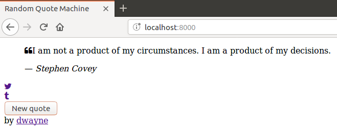

# Step 1

In this step your goal is to structure the app using HTML. When you complete
this step your app will look like the following:



## Plan

1. [Set up the project](#set-up-the-project).
2. [Write the HTML](#write-the-html).
3. [View the HTML in a browser](#view-the-html-in-a-browser).

## Set up the project

Create a new directory named `random-quote-machine` and in it create an
`index.html` file.

```sh
$ mkdir random-quote-machine
$ cd random-quote-machine
$ touch index.html
```

**N.B.** *In the future when I refer to "the root of the project" I will mean
the `random-quote-machine` directory.*

## Write the HTML

Open the `index.html` file in your favourite editor and write the following:

```html
<!doctype html>
<html lang="en">
  <head>
    <meta charset="utf-8">
    <meta name="viewport" content="width=device-width, initial-scale=1">

    <title>Random Quote Machine</title>

    <link rel="stylesheet" href="https://cdnjs.cloudflare.com/ajax/libs/font-awesome/4.7.0/css/font-awesome.min.css" />
  </head>
  <body>
    <!-- 1 -->
  </body>
</html>
```

It's standard HTML boilerplate. Read the following if you need to brush up on
your HTML:

- [Introduction to HTML5](https://developer.mozilla.org/en-US/docs/Web/Guide/HTML/HTML5/Introduction_to_HTML5)
- [Using the viewport meta tag to control layout on mobile browsers](https://developer.mozilla.org/en-US/docs/Mozilla/Mobile/Viewport_meta_tag)

You will be using [Font Awesome](https://fontawesome.com/v4.7.0/) for a
[left quote](https://fontawesome.com/v4.7.0/icon/quote-left) and the
[Twitter](https://fontawesome.com/v4.7.0/icon/twitter) and
[Tumblr](https://fontawesome.com/v4.7.0/icon/tumblr) icons.

Next, in the place of `<!-- 1 -->` add a `div` for the background and within
that add a `div` to wrap the quotation box and the attribution.

```html
<!-- Background -->
<div>
  <!-- Wraps the quotation box and attribution -->
  <div>
    <!-- Quotation box -->
    <!-- 2 -->

    <!-- Attribution -->
    <!-- 3 -->
  </div>
</div>
```

The quotation box contains a quote and its author, a link to tweet the quote,
a link to post the quote to Tumblr and a button to display a new random quote.

Replace `<!-- 2 -->` with the following:

```html
<div>
  <!-- Quote and author -->
  <blockquote>
    <!-- Quote -->
    <p>
      <span><i class="fa fa-quote-left"></i></span>I am not a product of my circumstances. I am a product of my decisions.
    </p>
    <!-- Author -->
    <footer>
      &mdash; <cite>Stephen Covey</cite>
    </footer>
  </blockquote>

  <!-- Actions -->
  <div>
    <!-- Tweet it -->
    <div>
      <a href="https://twitter.com/intent/tweet?hashtags=quotes&text=%22I%20am%20not%20a%20product%20of%20my%20circumstances.%20I%20am%20a%20product%20of%20my%20decisions.%22%20%E2%80%94%20Stephen%20Covey" target="_blank"><i class="fa fa-twitter"></i></a>
    </div>
    <!-- Post it to Tumblr -->
    <div>
      <a href="https://www.tumblr.com/widgets/share/tool?posttype=quote&tags=quotes&content=I%20am%20not%20a%20product%20of%20my%20circumstances.%20I%20am%20a%20product%20of%20my%20decisions.&caption=Stephen%20Covey&canonicalUrl=https%3A%2F%2Fwww.tumblr.com%2Fdocs%2Fen%2Fshare_button" target="_blank"><i class="fa fa-tumblr"></i></a>
    </div>
    <!-- Get a new random quote -->
    <div>
      <button type="button" autofocus>New quote</button>
    </div>
  </div>
</div>
```

[The blockquote element](https://html.spec.whatwg.org/multipage/grouping-content.html#the-blockquote-element)
is used since it is semantically appropriate for what we
want to do.

The [em dash](https://www.thepunctuationguide.com/em-dash.html) precedes the
author's name when attributing the quotation.

Read the Tweet
[Web Intent](https://developer.twitter.com/en/docs/twitter-for-websites/tweet-button/guides/web-intent.html)
guide to learn how the Twitter web intent URL was generated. And, read the
[Share Button Documentation](https://www.tumblr.com/docs/en/share_button) to
learn how the Tumblr share URL was generated.

The "New quote" button is the primary call to action so it is given the
initial focus.

Finally, replace `<!-- 3 -->` with the following:

```html
<footer>
  by <a href="https://github.com/dwayne/" target="_blank">dwayne</a>
</footer>
```

Feel free to change the URL and the name.

## View the HTML in a browser

You are free to use whatever method works for you.

But, here's what I usually do.

I open a new terminal window, change to the root of the project and start a
[SimpleHTTPServer](https://docs.python.org/2/library/simplehttpserver.html)
with [python](https://docs.python.org/2/using/cmdline.html).

```sh
$ python -m SimpleHTTPServer
```

It starts an HTTP server running on port 8000 that serves the contents of my current directory.

I then open a browser and navigate to http://localhost:8000/ in order to view
it.

The end. Go to [step 2](step-02.md).
