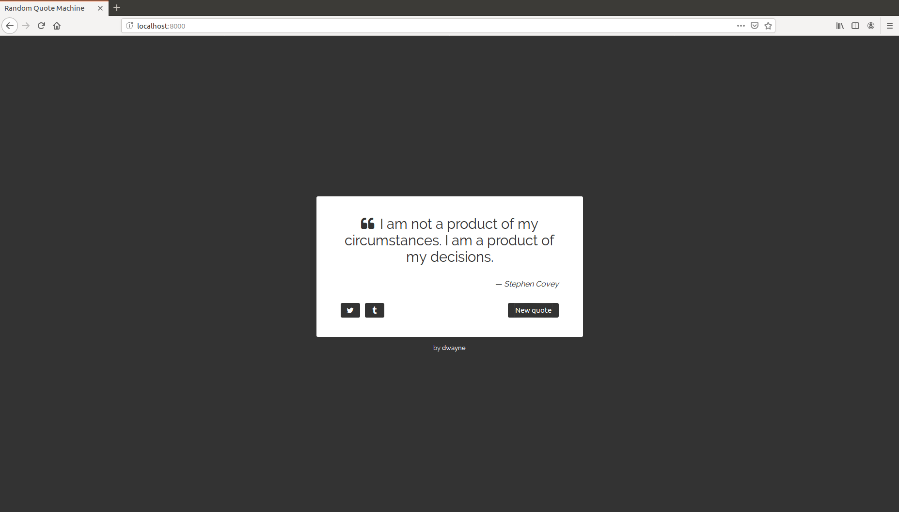

# Step 2

## Goal

To style the app using CSS.

This is what you will be trying to reproduce:



## Plan

1. Apply general styles.
2. Style the background.
3. Style the quotation box.
4. Style the attribution.

## Apply general styles

```css
@import url("https://fonts.googleapis.com/css?family=Raleway:400,500");

/* General */

body {
  margin: 0;
  height: 100vh;

  font-family: Raleway, sans-serif;
  font-weight: 400;
}
```

**Notes:**

- Learn more about the [Raleway](https://fonts.google.com/specimen/Raleway) font.

## Style the background

```html
<!-- Background -->
<div class="background">
  <!-- Wraps the quotation box and attribution -->
  <div>
    <!-- ... -->
  </div>
</div>
```

```css
/* Background */

.background {
  height: 100vh;

  display: flex;
  align-items: center;
  justify-content: center;

  background-color: #333;
}
```

The `body` and `.background` take up the entire viewport. The `.background` lays
out its elements using the [flexbox model](https://developer.mozilla.org/en-US/docs/Web/CSS/CSS_Flexible_Box_Layout).
The `div` that wraps the quotation box and attribution is the sole child of the
`.background` and so it will be horizontally and vertically centered within the
viewport.

## Style the quotation box

```html
<!-- Quotation box -->
<div class="quote-box">
  <!-- Quote and author -->
  <blockquote class="quote-box__blockquote">
    <!-- Quote -->
    <p class="quote-box__quote-wrapper">
      <span class="quote-left"><i class="fa fa-quote-left"></i></span>...
    </p>
    <!-- Author -->
    <footer class="quote-box__author-wrapper">
      &#8212; <cite class="author">...</cite>
    </footer>
  </blockquote>

  <!-- Actions -->
  <div class="quote-box__actions">
    <!-- Tweet it -->
    <div>
      <a href="..." target="_blank" class="icon-button"><i class="fa fa-twitter"></i></a>
    </div>
    <!-- Post to Tumblr -->
    <div>
      <a href="..." target="_blank" class="icon-button"><i class="fa fa-tumblr"></i></a>
    </div>
    <!-- Get a new quote -->
    <div>
      <button type="button" autofocus class="button">New quote</button>
    </div>
  </div>
</div>
```

```css
/* Quote box */

.quote-box {
  width: 450px;
  padding: 40px 50px;

  border-radius: 3px;

  color: #333;
  background-color: #fff;
}

.quote-box__blockquote {
  margin: 0 0 30px 0;
}

.quote-box__quote-wrapper {
  margin-top: 0;

  text-align: center;
  font-size: 1.8rem;
}

.quote-box__quote-wrapper .quote-left {
  margin-right: 12px;
}

.quote-box__author-wrapper {
  text-align: right;
}

.quote-box__author-wrapper .author {
  font-style: italic;
}

.quote-box__actions {
  display: flex;
}

.quote-box__actions .button {
  height: 30px;

  padding-left: 15px;
  padding-right: 15px;

  border: 0;
  border-radius: 3px;

  cursor: pointer;

  color: #fff;
  background-color: #333;
}

.quote-box__actions .icon-button {
  display: flex;
  align-items: center;
  justify-content: center;

  width: 40px;
  height: 30px;

  border-radius: 3px;

  text-decoration: none;

  color: #fff;
  background-color: #333;
}

.quote-box__actions .button:hover,
.quote-box__actions .icon-button:hover {
  opacity: 0.9;
}

.quote-box__actions > div:first-child {
  margin-right: 10px;
}

.quote-box__actions > div:last-child {
  margin-left: auto;
}
```

## Style the attribution

```html
<!-- Attribution -->
<footer class="attribution">
  by <a href="https://github.com/dwayne/" target="_blank" class="attribution__link">dwayne</a>
</footer>
```

```css
/* Attribution */

.attribution {
  margin-top: 15px;

  text-align: center;
  font-size: 0.8rem;

  color: #fff;
}

.attribution__link {
  text-decoration: none;
  font-weight: 500;

  color: #fff;
}
```
