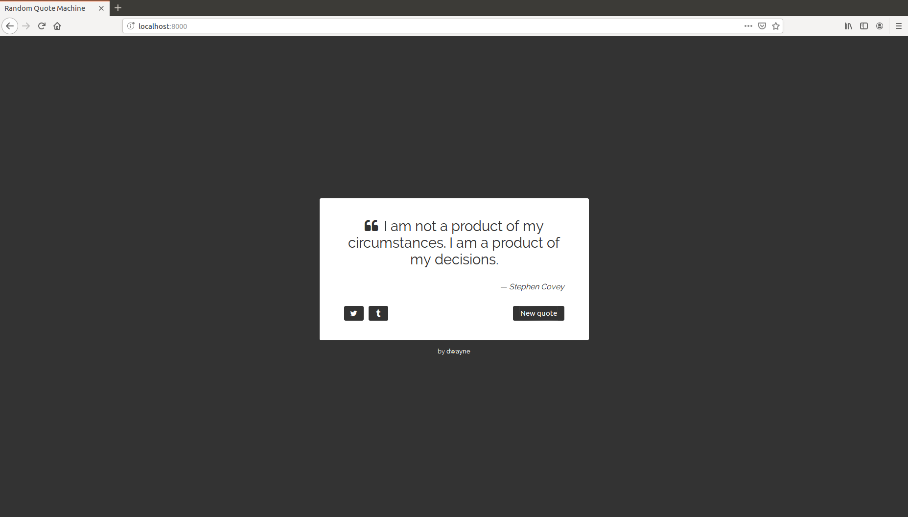

# Step 3

In this step your goal is to start using Elm. When you complete this step your
app will look exactly as it did after step 2.



**N.B.** *This step assumes you already have Elm installed. If you don't that's
fine, just go [here](https://guide.elm-lang.org/install.html) to learn how to
do it.*

## Plan

1. [Port the HTML to Elm](#port-the-html-to-elm).
2. [Compile to JavaScript](#compile-to-javascript).
3. [Load it](#load-it).

## Port the HTML to Elm

Go to your project's root directory and run `elm init`.

```sh
$ cd path/to/random-quote-machine
$ elm init
```

Press ENTER at the prompt to have an `elm.json` file and an empty `src`
directory created for you.

The `elm.json` file tracks dependencies and other metadata for your app.

The `src` directory is where you place all the Elm files comprising your app.
In this case you'll need one file, `src/Main.elm`.

**N.B.** *You can read https://elm-lang.org/0.19.0/init to learn more about
`elm init`.*

Go ahead and create that file now.

```sh
$ touch src/Main.elm
```

And, edit it to contain the following:

```elm
module Main exposing (main)


import Html exposing (Html, a, blockquote, button, cite, div, footer, i, p, span, text)
import Html.Attributes exposing (autofocus, class, href, target, type_)


main : Html msg
main =
  div [ class "background" ]
    [ div []
        [ div [ class "quote-box" ]
            [ blockquote [ class "quote-box__blockquote"]
                [ p [ class "quote-box__quote-wrapper" ]
                    [ span [ class "quote-left" ]
                        [ i [ class "fa fa-quote-left" ] [] ]
                    , text "I am not a product of my circumstances. I am a product of my decisions."
                    ]
                , footer [ class "quote-box__author-wrapper" ]
                    [ text "\u{2014} "
                    , cite [ class "author" ] [ text "Stephen Covey" ]
                    ]
                ]
            , div [ class "quote-box__actions" ]
                [ div []
                    [ a [ href "https://twitter.com/intent/tweet?hashtags=quotes&text=%22I%20am%20not%20a%20product%20of%20my%20circumstances.%20I%20am%20a%20product%20of%20my%20decisions.%22%20%E2%80%94%20Stephen%20Covey"
                        , target "_blank"
                        , class "icon-button"
                        ]
                        [ i [ class "fa fa-twitter" ] [] ]
                    ]
                , div []
                    [ a [ href "https://www.tumblr.com/widgets/share/tool?posttype=quote&tags=quotes&content=I%20am%20not%20a%20product%20of%20my%20circumstances.%20I%20am%20a%20product%20of%20my%20decisions.&caption=Stephen%20Covey&canonicalUrl=https%3A%2F%2Fwww.tumblr.com%2Fdocs%2Fen%2Fshare_button"
                        , target "_blank"
                        , class "icon-button"
                        ]
                        [ i [ class "fa fa-tumblr" ] [] ]
                    ]
                , div []
                    [ button
                        [ type_ "button"
                        , autofocus True
                        , class "button"
                        ]
                        [ text "New quote" ]
                    ]
                ]
            ]
        , footer [ class "attribution" ]
            [ text "by "
            , a [ href "https://github.com/dwayne/"
                , target "_blank"
                , class "attribution__link"
                ]
                [ text "dwayne" ]
            ]
        ]
    ]
```

An Elm file is called a module. The first line names the module, `Main`, and
makes the `main` function available for use by the outside world.

The import lines import various functions from the
[Html](https://package.elm-lang.org/packages/elm/html/1.0.0/Html) and
[Html.Attributes](https://package.elm-lang.org/packages/elm/html/1.0.0/Html-Attributes)
modules for use in your `Main` module.

The `Html` and `Html.Attributes` modules exist in the
[elm/html](https://package.elm-lang.org/packages/elm/html/1.0.0/) package. If
you look in your `elm.json` file you'd see that `elm init` has already set you
up with the `elm/html` package as a direct dependency. This means you won't
need to install it. Later on there will be modules you'll need to use from
other packages that you'll need to install but don't worry about it since the
process is usually painless.

**N.B.** *Read https://elm-lang.org/0.19.0/imports to learn more about how the
`import` declarations work.*

The `main` function contains mostly what you'd find in `index.html`
except that instead of HTML tags and attributes you have function calls.

In general,

```html
<foo attr1="a" attr2="b">bar</foo>
```

is translated into:

```elm
foo [ attr1 "a", attr2 "b" ] [ text "bar" ]
```

where `foo` and `text` are in `Html` and `attr1` and `attr2` are in
`Html.Attributes`.

The only minor difference is the use of the Unicode code point `\u{2014}`
instead of the `&mdash;` HTML entity.

**N.B.** *You can try using `&mdash;` in place of the Unicode code point to see
what happens. Also, try messing with the Unicode code point syntax to observe
the various error messages that the Elm compiler would generate to help you get
the syntax right.*

**N.B.** *You can find Unciode code points for your HTML entities at
https://ascii.cl/htmlcodes.htm.*

## Compile to JavaScript

```sh
elm make src/Main.elm --output=assets/app.js
```

The `Main` module is compiled to JavaScript and saved in `assets/app.js`.

## Load it

Edit `index.html` and replace the `body` with the following:

```html
<body>
  <div id="app"></div>
  <script src="assets/app.js"></script>
  <script>
    Elm.Main.init({
      node: document.getElementById("app")
    });
  </script>
</body>
```

View `index.html` in a browser and observe that absolutely nothing has changed.
That's a good thing. It means you faithfully converted the HTML to Elm.

The end. Go to [step 4](step-04.md).
